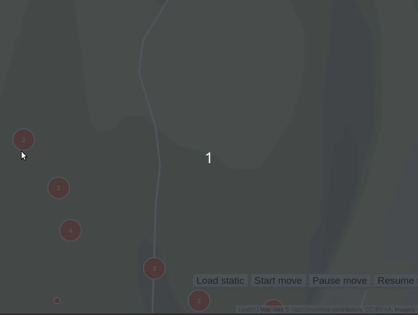
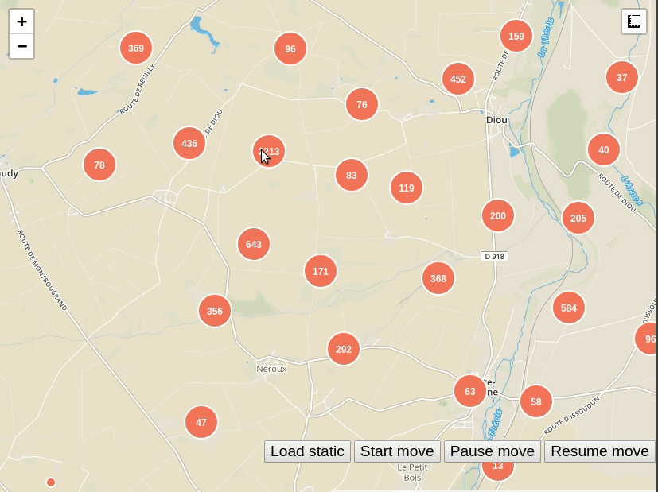

# leaflet-superclaster

Leaflet binding for [supercluster](https://github.com/mapbox/supercluster) 

| move         | static        |
| -------------   |:-------------:|
|  | | 
| [example](https://grinat.github.io/leaflet-superclaster/examples/static.html) | [example](https://grinat.github.io/leaflet-superclaster/examples/move.html)  |


```js
import * as L from 'leaflet'

import {SuperclusterGroup} from 'leaflet-superclaster'
import 'leaflet-superclaster/dist/supercluster.css'

this.superclusterGroup = new SuperclusterGroup().addTo(this.map)
this.superclusterGroup.on('point.click', function({parentLayer, layer, target}) {
  let popup = layer.getPopup()
  if (!popup) {
    popup = L.popup({
      autoClose: false,
      closeOnClick: false,
      autoPan: false
    }).setContent(JSON.stringify(layer.feature.properties))
    layer.bindPopup(popup).openPopup()
  }
})

this.superclusterGroup.on('layer.updated', function ({layer}) {
  const popup = layer.getPopup()
  if (popup && popup.isOpen()) {
    popup.setContent(JSON.stringify(layer.feature.properties))
  }
})
          
const features = [{
  properties: {
    // !! id in properties are required
    // used for redraw markers which changes the position
    id: 1
  },
  type: "Feature",
  geometry: {type: "Point", coordinates: [45, 66]}
}]
this.superclusterGroup.loadGeoJsonData(features)
```

## Methods

```
loadGeoJsonData(features) - set markers positions
keepPoint(id) - Save point id for keep in view useful if appended popup with keepView optio
unKeepPoint(id) - 
```

## Events


| name            | params                     | desciption |
| -------------   |:-------------:             | -----:|
| point.click     | parentLayer, layer, target | Fired on click by point |
| cluster.click     | parentLayer, layer, target | Fired on click by cluster |
| layer.updated   | layer, target              | fired on layer position(lat, lng) was updated |
| draw            | layer, target                      | fired after markers draw, return layers with markers |
| end            |                       | all data in worker executed |
| wait            |                      | data execution in worker |

## Development
Run webpack in dev mode and server with fixtures data
```
npm run watch
```

## Tests
```
npm run test:e2e
```

### Fallback
For use in ie 11 with webpack. Install copy-webpack-plugin and copy leaflet-superclaster.worker.js to root folder:
```
const CopyPlugin = require('copy-webpack-plugin')

...
plugins: [
  new CopyPlugin([
    { from: 'node_modules/leaflet-superclaster/dist/leaflet-superclaster.worker.js', to: 'leaflet-superclaster.worker.js' }
  ])
]
...

```
